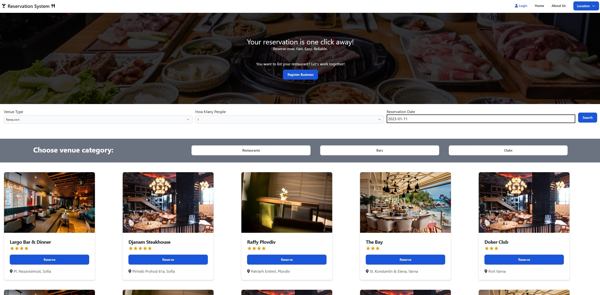
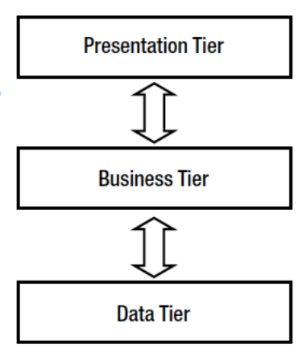

# Night Out Reservation System

"Night Out" Reservation system is a Full-Stack JS Project, for E-Business course in FMI.

 &nbsp;&nbsp;&nbsp;&nbsp;&nbsp;&nbsp;&nbsp;&nbsp;&nbsp;&nbsp;&nbsp;&nbsp;&nbsp;&nbsp;&nbsp;&nbsp;&nbsp;&nbsp;&nbsp;&nbsp;&nbsp;&nbsp;&nbsp;&nbsp;&nbsp;&nbsp;&nbsp;&nbsp;&nbsp;&nbsp;&nbsp;&nbsp;

## Description:

The idea of the project is to represent a reservation system, through which the end user can book places like restourants, bars, night clubs and more. The business idea here is for owners of these places to be able to serve their customers with an easy way of booking places in order to have good time. There is no need for telephone calls or uneccessary work for the employees - everything is automated thanks to the system.

## Technologies used:

The project consists of a `Three-Tier-Architecture` | **CLIENT <=> SERVER <=> SQL DATABASE**

 &nbsp;&nbsp;&nbsp;&nbsp;&nbsp;&nbsp;&nbsp;&nbsp;&nbsp;&nbsp;&nbsp;&nbsp;&nbsp;&nbsp;&nbsp;&nbsp;&nbsp;&nbsp;&nbsp;&nbsp;&nbsp;&nbsp;&nbsp;&nbsp;&nbsp;&nbsp;&nbsp;&nbsp;&nbsp;&nbsp;&nbsp;&nbsp;
image.png

Front-End Technologies:

- React.js
- Flowbite
- Chakra UI
- Axios
- Formik, Yup

Back-End Technologies:

- Node.js
- Express
- Knex + Objection ORM

DB:

- PostgreSQL
